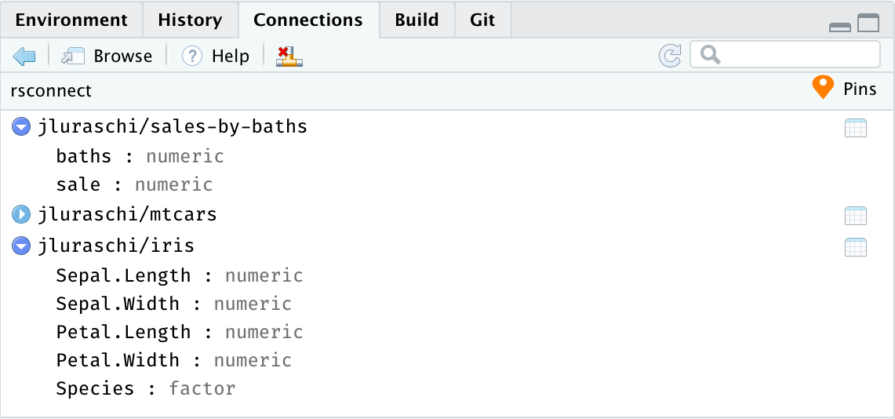

pins: Pin, Discover and Share Resources
================

[](https://travis-ci.org/rstudio/pins)
[](https://cran.r-project.org/package=pins)
[](https://www.tidyverse.org/lifecycle/#experimental)

You can use the `pins` package from **R**, or **Python**, to:

  - **Pin** remote resources to work offline with `pin()`.
  - **Discover** new resources across different boards using
    `pin_find()`.
  - **Share** resources with your team, or the world with
    `board_register()`.
  - **Resources** can be shareed with GitHub, Kaggle or RStudio Connect
    boards.

To start using `pins`, install this package as follows:

``` r
install.packages("remotes")
remotes::install_github("rstudio/pins")
```

You can **pin** remote files with `pin()` to cache those files locally,
such that, even if the remote resource is removed or while working
offline, your code will keep working by using a local cache:

``` r
library(tidyverse)
library(pins)

retail_sales <- read_csv(pin("https://raw.githubusercontent.com/facebook/prophet/master/examples/example_retail_sales.csv"))
```

You can also cache intermediate results to avoid having to recompute
expensive operations:

``` r
retail_sales %>%
  group_by(month = lubridate::month(ds, T)) %>%
  summarise(total = sum(y)) %>%
  pin("sales_by_month")
```

    ## # A tibble: 12 x 2
    ##    month   total
    ##    <ord>   <dbl>
    ##  1 Jan   6896303
    ##  2 Feb   6890866
    ##  3 Mar   7800074
    ##  4 Apr   7680417
    ##  5 May   8109219
    ##  6 Jun   7451431
    ##  7 Jul   7470947
    ##  8 Aug   7639700
    ##  9 Sep   7130241
    ## 10 Oct   7363820
    ## 11 Nov   7438702
    ## 12 Dec   8656874

You can also **discover** remote resources using `pin_find()` which can
search CRAN packages and Kaggle. Kaggle requires to configure it by
running once `board_register("kaggle", token =
"<path-to-kaggle.json>")`. Then we can search resources mentioning
“seattle” in CRAN packages and Kaggle with ease:

``` r
pin_find("seattle")
```

    ## # A tibble: 24 x 4
    ##    name                     description                        type  board 
    ##    <chr>                    <chr>                              <chr> <chr> 
    ##  1 hpiR/seattle_sales       Seattle Home Sales from hpiR pack… table packa…
    ##  2 microsynth/seattledmi    Data for a crime intervention in … table packa…
    ##  3 vegawidget/data_seattle… Example dataset: Seattle daily we… table packa…
    ##  4 vegawidget/data_seattle… Example dataset: Seattle hourly t… table packa…
    ##  5 airbnb/seattle           Seattle Airbnb Open Data           files kaggle
    ##  6 aaronschlegel/seattle-p… Seattle Pet Licenses               files kaggle
    ##  7 shanelev/seattle-airbnb… Seattle Airbnb Listings            files kaggle
    ##  8 seattle-public-library/… Seattle Library Checkout Records   files kaggle
    ##  9 rtatman/did-it-rain-in-… Did it rain in Seattle? (1948-201… files kaggle
    ## 10 city-of-seattle/seattle… Seattle Checkouts by Title         files kaggle
    ## # … with 14 more rows

Notice that all pins are referenced as `<owner>/<name>` and even if the
`<owner>` is not provided, each board will assign an appropriate one.
While you can ignore `<owner>` and reference pins by `<name>`, this can
fail in some boards if different owners assign the same name to a pin.

You can then retrieve a pin as a local path through `pin_get()`,

``` r
pin_get("hpiR/seattle_sales")
```

    ## # A tibble: 43,313 x 16
    ##    pinx  sale_id sale_price sale_date  use_type  area lot_sf  wfnt
    ##    <chr> <chr>        <int> <date>     <chr>    <int>  <int> <dbl>
    ##  1 ..00… 2013..…     289000 2013-02-06 sfr         79   9295     0
    ##  2 ..00… 2013..…     356000 2013-07-11 sfr         18   6000     0
    ##  3 ..00… 2010..…     333500 2010-12-29 sfr         79   7200     0
    ##  4 ..00… 2016..…     577200 2016-03-17 sfr         79   7200     0
    ##  5 ..00… 2012..…     237000 2012-05-02 sfr         79   5662     0
    ##  6 ..00… 2014..…     347500 2014-03-11 sfr         79   5830     0
    ##  7 ..00… 2012..…     429000 2012-09-20 sfr         18  12700     0
    ##  8 ..00… 2015..…     653295 2015-07-21 sfr         79   7000     0
    ##  9 ..00… 2014..…     427650 2014-02-19 townhou…    79   3072     0
    ## 10 ..00… 2015..…     488737 2015-03-19 townhou…    79   3072     0
    ## # … with 43,303 more rows, and 8 more variables: bldg_grade <int>,
    ## #   tot_sf <int>, beds <int>, baths <dbl>, age <int>, eff_age <int>,
    ## #   longitude <dbl>, latitude <dbl>

Finally, you can also **share** resources with others by publishing to
particular to Kaggle, GitHub and RStudio Connect. We can easily publish
`iris` to Kaggle as follows:

``` r
pin(iris, board = "kaggle")
```

And use all the functionality available in `pins` from Python as well:

``` python
import pins

pins.pin_get("hpiR/seattle_sales")
```

There are other boards you can use or even create custom boards as
described in the [Understanding
Boards](https://rstudio.github.io/pins/articles/boards.html) article; in
addition, `pins` can also be used with RStudio products which we will
describe next.

## RStudio

You can use [RStudio](https://www.rstudio.com/products/rstudio/) to
discover and pin remote files and [RStudio
Connect](https://www.rstudio.com/products/connect/) to share content
within your organization with ease.

To **discover** remote resources, simply expand the “Addins” menu and
select “Find Pin” from the dropdown:

<center>


</center>

Notice that, the RStudio connections pane helps you track your pins by
providing each board as a connection you can explore:

<center>



</center>

You can **share** local files and content using the RStudio Connect
board. Lets use `dplyr` and the `hpiR_seattle_sales` pin to analyze this
further and then pin our results in RStudio Connect:

``` r
board_register("rstudio")
```

``` r
pin_get("hpiR/seattle_sales") %>%
  group_by(baths = ceiling(baths)) %>%
  summarise(sale = floor(mean(sale_price))) %>%
  pin("sales-by-baths", board = "rstudio")
```

    ## Preparing to deploy data...DONE
    ## Uploading bundle for data: 5308...DONE
    ## Deploying bundle: 12643 for data: 5308 ...

    ## Building static content...

    ## Launching static content...

    ## Data successfully deployed to https://beta.rstudioconnect.com/content/5308/

    ## # A tibble: 8 x 2
    ##   baths    sale
    ##   <dbl>   <dbl>
    ## 1     1  413950
    ## 2     2  516480
    ## 3     3  638674
    ## 4     4  939602
    ## 5     5 1748859
    ## 6     6 3384514
    ## 7     7 3063043
    ## 8     8 4550750

<center>


</center>

You can now set the appropriate permissions in RStudio Connect, and
voila\! From now on, those with access can make use of this remote file
locally\!

For instance, a colleague can reuse the `sales-by-baths` pin by
retrieving it from RStudio Connect and visualize its contents using
`ggplot2`:

``` r
pin_get("sales-by-baths") %>%
  ggplot(aes(x = baths, y = sale)) +
    theme_light() + geom_point() +
    geom_smooth(method = 'lm', formula = y ~ exp(x))
```


Please make sure to ~~pin~~ visit
[rstudio.github.io/pins](https://rstudio.github.io/pins/) to find
detailed documentation and additional resources.
