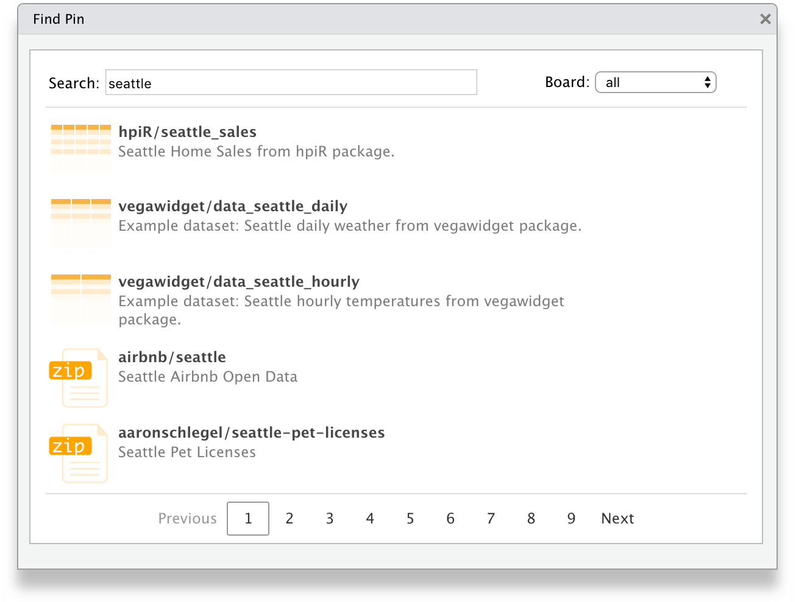
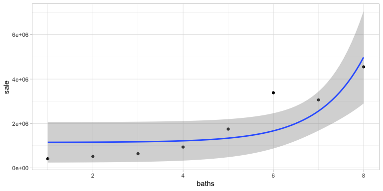

pins: Pin and Share Remote Files
================

# pins: Pin and Share Remote Files

[](https://travis-ci.org/rstudio/pins)
[](https://cran.r-project.org/package=pins)
[](https://www.tidyverse.org/lifecycle/#experimental)

You can use the `pins` package from **R**, or **Python**, to:

  - **Pin** remote files into a local cache with `pin()` to work offline
    and even if the remote source is removed.
  - **Share** files by pinning them in GitHub, Kaggle or RStudio
    Connect; find pins with `find_pin()` and retrieve their contents
    with `get_pin()`.

To start using `pins`, install this package as follows:

``` r
install.packages("remotes")
remotes::install_github("rstudio/pins")
```

You can **pin** remote files with `pin()` to cache those files locally,
such that, even if the remote resource is removed or while working
offline, your code will keep working by using a local cache:

``` r
library(pins)
retail_sales <- readr::read_csv(pin("https://raw.githubusercontent.com/facebook/prophet/master/examples/example_retail_sales.csv", "sales"))
```

You can also cache intermediate results to avoid having to recompute
expensive operations:

``` r
retail_sales %>%
  dplyr::group_by(month = lubridate::month(ds, T)) %>%
  dplyr::summarise(total = sum(y)) %>%
  pin("sales_by_month")
```

    ## # A tibble: 12 x 2
    ##    month   total
    ##    <ord>   <dbl>
    ##  1 Jan   6896303
    ##  2 Feb   6890866
    ##  3 Mar   7800074
    ##  4 Apr   7680417
    ##  5 May   8109219
    ##  6 Jun   7451431
    ##  7 Jul   7470947
    ##  8 Aug   7639700
    ##  9 Sep   7130241
    ## 10 Oct   7363820
    ## 11 Nov   7438702
    ## 12 Dec   8656874

You can also find remote files using `find_pin()` which can find files
embedded in CRAN packages, but you can also configure Kaggle with ease
with `register_board()`. For instance, we can search files mentioning
“seattle”:

``` r
register_board("kaggle", token = "<path-to-kaggle.json>")
find_pin("seattle")
```

    ## # A tibble: 24 x 4
    ##    name                     description                        type  board 
    ##    <chr>                    <chr>                              <chr> <chr> 
    ##  1 hpiR_seattle_sales       Seattle Home Sales from hpiR pack… table packa…
    ##  2 microsynth_seattledmi    Data for a crime intervention in … table packa…
    ##  3 vegawidget_data_seattle… Example dataset: Seattle daily we… table packa…
    ##  4 vegawidget_data_seattle… Example dataset: Seattle hourly t… table packa…
    ##  5 airbnb/seattle           Seattle Airbnb Open Data           files kaggle
    ##  6 shanelev/seattle-airbnb… Seattle Airbnb Listings            files kaggle
    ##  7 aaronschlegel/seattle-p… Seattle Pet Licenses               files kaggle
    ##  8 seattle-public-library/… Seattle Library Checkout Records   files kaggle
    ##  9 rtatman/did-it-rain-in-… Did it rain in Seattle? (1948-201… files kaggle
    ## 10 city-of-seattle/seattle… Seattle Checkouts by Title         files kaggle
    ## # … with 14 more rows

Finally, you can also **share** local files and content by publishing to
particular boards,

``` r
pin(iris, "iris", board = "kaggle")
```

And use all the functionality available in `pins` from Python as well:

``` python
import pins
import pandas as pd

pd.read_csv(pins.get_pin("sales"))
```

There are other boards you can use or even create custom boards as
described in the [Understanding
Boards](https://rstudio.github.io/pins/articles/boards.html) article; in
addition, `pins` can also be used with RStudio products which we will
describe next.

## RStudio

You can use [RStudio](https://www.rstudio.com/products/rstudio/) to
discover and pin remote files and [RStudio
Connect](https://www.rstudio.com/products/connect/) to share content
within your organization with ease.

To find remote resources, simply expand the “Addins” menu and select
“Find Pin” from the dropdown:



Notice that, the RStudio connections pane helps you track your pins by
providing each board as a connection you can explore:


You can **share** local files and content using the RStudio Connect
board. Lets use `dplyr` and the `hpiR_seattle_sales` pin to analyze this
further and then share our results in RStudio Connect:

``` r
use_board("rstudio")
```

``` r
get_pin("hpiR_seattle_sales") %>%
  dplyr::group_by(baths = ceiling(baths)) %>%
  dplyr::summarise(sale = floor(mean(sale_price))) %>%
  pin("sales-by-baths")
```

    ## Preparing to deploy data...DONE
    ## Uploading bundle for data: 5221...DONE
    ## Deploying bundle: 12466 for data: 5221 ...

    ## Building static content...

    ## Launching static content...

    ## Data successfully deployed to https://beta.rstudioconnect.com/content/5221/

    ## # A tibble: 8 x 2
    ##   baths    sale
    ##   <dbl>   <dbl>
    ## 1     1  413950
    ## 2     2  516480
    ## 3     3  638674
    ## 4     4  939602
    ## 5     5 1748859
    ## 6     6 3384514
    ## 7     7 3063043
    ## 8     8 4550750


You can now set the appropriate permissions in RStudio Connect, and
voila\! From now on, those with access can make use of this remote file
locally\!

For instance, a colleague can reuse the `sales-by-baths` pin by
retrieving it from RStudio Connect and visualize its contents using
`ggplot2`:

``` r
library(ggplot2)

pins::get_pin("sales-by-baths") %>%
  ggplot(aes(x = baths, y = sale)) +
    theme_light() + geom_point() +
    geom_smooth(method = 'lm', formula = y ~ exp(x))
```

<!-- -->

Please make sure to ~~pin~~ visit
[rstudio.github.io/pins](https://rstudio.github.io/pins/) to find
detailed documentation and additional resources.
